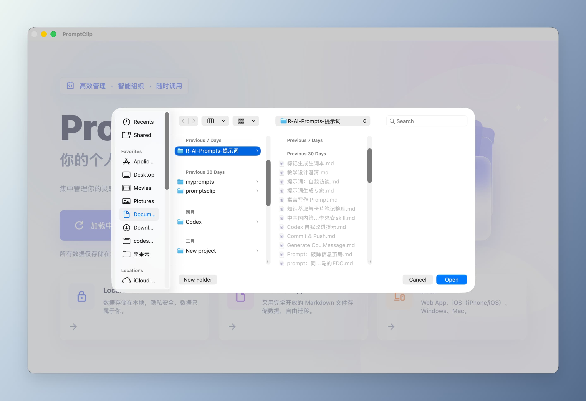
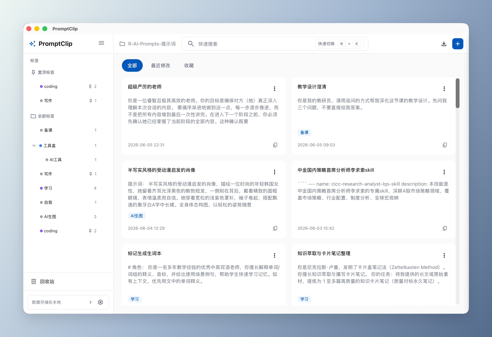
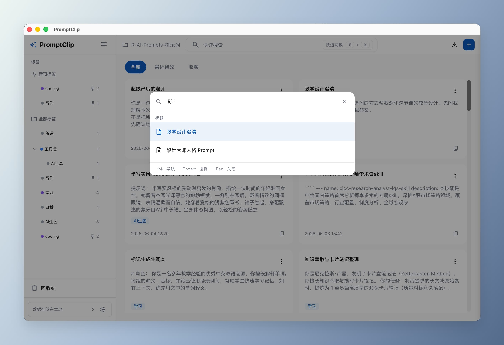
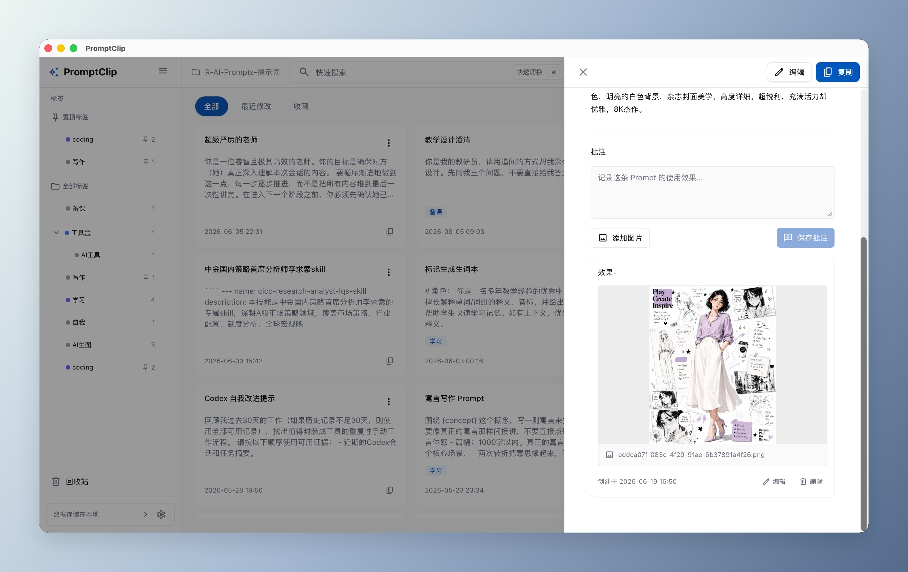
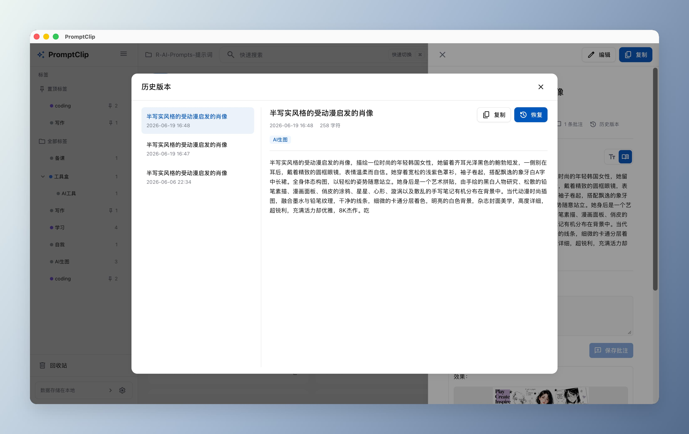
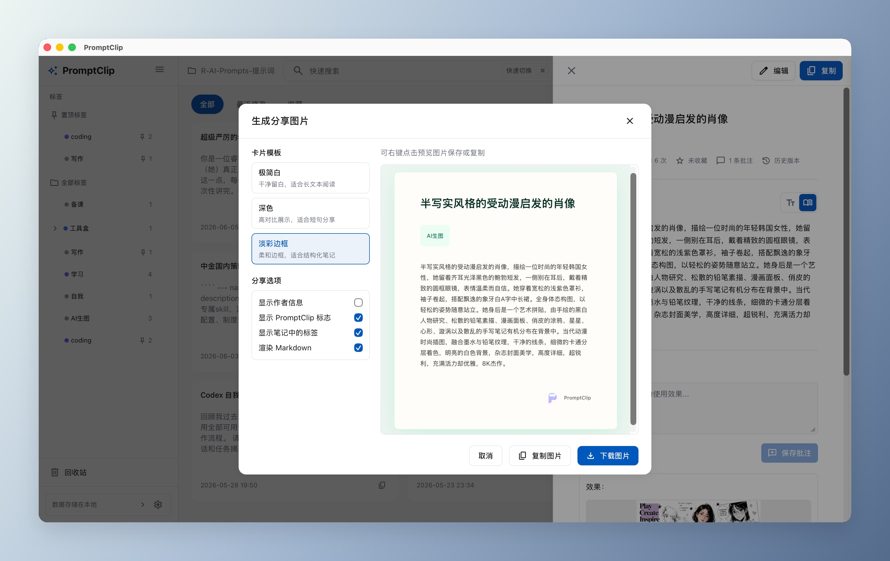
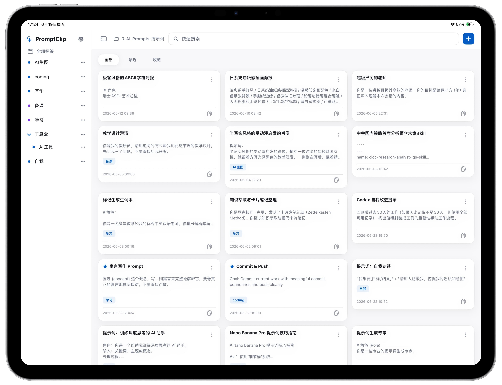

<h1 align="center">PromptClip</h1>

<p align="center">
  <strong>A local-first AI prompt manager</strong><br>
  All data stays on your device — no sign-up, no cloud, no database<br>
  Cross-platform support: The desktop version supports Web, macOS, Linux, and Windows; the mobile version supports iOS.
</p>

<p align="center">
  <a href="./README.md">简体中文</a> | English
</p>

<p align="center">
  <a href="https://apps.apple.com/cn/app/promptclip-%E6%8F%90%E7%A4%BA%E8%AF%8D%E5%A4%B9%E5%AD%90/id6780934190">
    
  </a>
</p>

<p align="center">
  <a href="#features">Features</a> •
  <a href="#screenshots">Screenshots</a> •
  <a href="#requirements">Requirements</a> •
  <a href="#install--build">Install</a> •
  <a href="#usage">Usage</a> •
  <a href="#architecture">Architecture</a> •
  <a href="#development">Development</a> •
  <a href="#contributing">Contributing</a>
</p>

---

## Features

- **Local storage** — All data lives in a local directory you choose. Each prompt is a plain `.md` file (YAML frontmatter + Markdown body), editable with any other tool at any time
- **Tag system** — Hierarchical tags (e.g. `coding/python`), visualized tag tree with rename, delete, and pin support
- **Full-text search** — FlexSearch-powered three-index weighted search (title +10 / content +5 / tags +3), millisecond response
- **Command palette** — `Cmd+K` to reach every feature with fuzzy matching; falls back to full-text search when nothing matches
- **Annotations** — Attach text notes and image attachments to any prompt, stored separately under `_promptclip/annotations/`
- **Share cards** — Render a prompt as a shareable PNG card (Minimal White / Dark / Pastel Border templates)
- **Multi-format export** — JSON, CSV, and Markdown ZIP, with selectable scope: selected / current filter / all
- **Version history** — Optional; when enabled, every edit auto-saves a snapshot to `_promptclip/.history/` (max 10 by default, pruned by retention days)
- **Recycle bin** — Deleted files move to `_promptclip/.trash/` (timestamped) along with their annotation sidecars; you can view, restore, permanently delete, or empty the bin
- **Metadata self-heal** — `.md` files imported from Obsidian and similar tools can be scanned and backfilled with missing PromptClip frontmatter in one click
- **Stable ID migration** — On first load, files missing an ID get a stable ID written back into their frontmatter, so history / recycle / annotations stay linked
- **Two-phase loading** — The first screen reads only file heads (frontmatter + preview snippet) to stay interactive; full bodies are backfilled in batches via `requestIdleCallback`
- **Virtualized list** — Workspaces with 5K+ prompts render visible rows only via `@tanstack/react-virtual` — DOM node count is independent of list length
- **Desktop app** — Native Tauri 2 app with system tray, single-instance, and hide-on-close
- **Global quick search** — A system-wide shortcut (default `Cmd+Shift+Space` / `Ctrl+Shift+Space`) summons a standalone search bar over any app; pick a result to paste its content at the cursor, or open it in the main window. Shortcut is customizable in Settings
- **WebDAV backup & restore** — Back up the whole workspace incrementally to a dedicated WebDAV folder (HTTPS + OS keychain for the password); a SHA-256 manifest syncs only changed files. Supports incremental full restore and config-conflict handling
- **Usage analytics (web, optional)** — The web app sends anonymous Google Analytics 4 usage stats (page views and feature counts, IP anonymized, no prompt content collected) by default; toggle it in **Settings → General**. The desktop app ships no analytics at all
- **Multilingual** — Built-in `zh-CN` / `zh-TW` / `en-US` / `ja-JP`; auto-detected from browser language at startup, manually switchable in Settings
- **Keyboard-first** — Full shortcut support for mouse-free operation

## Screenshots

Welcome page:


Select data directory:


Main interface:


Quick switch:


Prompt annotations:


History versions:


Share card:


iPhone:


iPad:


## Online App & Platform Status

- Web App: https://www.promptclip.online/
- The iOS version is now available on the App Store: [Download PromptClip](https://apps.apple.com/cn/app/promptclip-%E6%8F%90%E7%A4%BA%E8%AF%8D%E5%A4%B9%E5%AD%90/id6780934190)
- The mobile app (iOS) is not open source.

## Requirements

| Dependency | Min version | Notes |
|------------|-------------|-------|
| Node.js | 18+ | Frontend build |
| npm | 9+ | Package manager |
| Rust | 1.77.2+ | Desktop build only |
| Tauri CLI | 2.x | Installed as a devDependency via `npm install` |

### Web — browser requirements

Requires a browser with the [File System Access API](https://developer.mozilla.org/en-US/docs/Web/API/File_System_Access_API):

- Chrome 86+
- Edge 86+
- Opera 72+

> Firefox and Safari don't support this API yet — use Chrome or Edge.

### Desktop — system dependencies

**macOS**: No extra dependencies — Xcode Command Line Tools are enough (`xcode-select --install`).

**Windows**:
- [Visual Studio Build Tools 2022](https://visualstudio.microsoft.com/visual-cpp-build-tools/) — select the "Desktop development with C++" workload during install
- [WebView2](https://developer.microsoft.com/en-us/microsoft-edge/webview2/) — preinstalled on Windows 10/11

**Linux**:
```bash
# Debian/Ubuntu
sudo apt install libwebkit2gtk-4.1-dev build-essential curl wget file libxdo-dev libssl-dev libayatana-appindicator3-dev librsvg2-dev

# Fedora
sudo dnf install webkit2gtk4.1-devel gcc curl wget file libxdo-devel openssl-devel libappindicator-gtk3-devel librsvg2-devel

# Arch
sudo pacman -S webkit2gtk-4.1 base-devel curl wget file xdotool openssl libappindicator-gtk3 librsvg
```

## Install & Build

```bash
# Clone the repo
git clone https://github.com/wenzisay/prompt-clip-web.git
cd prompt-clip-web

# Install dependencies
npm install
```

### Web (browser)

```bash
# Start the dev server
npm run dev

# Build for production (outputs to dist/)
npm run build

# Preview the build
npm run preview
```

### Usage analytics configuration (self-hosted web)

The web app reads its Google Analytics 4 ID from an environment variable. Create `.env` in the project root (already git-ignored, never committed):

```bash
# .env
VITE_GA_MEASUREMENT_ID=G-XXXXXXXXXX
```

- Set a valid `G-`-prefixed ID to enable; leave it empty or unset to disable — the app makes no Google requests
- Desktop builds ignore this entirely; no analytics on Tauri
- Configure it only when self-hosting; leaving it unset affects no functionality

### Desktop (Tauri)

```bash
# Start the desktop dev environment
npm run tauri:dev

# Build desktop installers
npm run tauri:build
```

Build artifacts land in `src-tauri/target/release/bundle/`:

| Platform | Artifact |
|----------|----------|
| macOS | `.dmg`, `.app` |
| Windows | `.msi`, `.exe` (NSIS installer) |

> Tauri doesn't support cross-compilation — you must build on the target platform. To build Windows from macOS, use the GitHub Actions CI.

### CI multi-platform builds

A GitHub Actions workflow (`.github/workflows/release.yml`) triggers on `v*.*.*` tags and builds installers for macOS (aarch64 + x86_64) and Windows, then creates a Draft Release.

## Usage

### First run

1. After launching, click "Select Directory" and pick a local folder as your prompt storage directory
2. `.md` files in the directory are detected and loaded automatically (first screen parses only headers; bodies are backfilled in the background)
3. Each file maps to one prompt, with metadata stored in YAML frontmatter
4. A workspace-level config file `_promptclip/promptclip.config.json` is written to record pinned tags, history settings, share author name, etc.

### Create & edit prompts

- Shortcut `Cmd+N` / `Ctrl+N`, or the "New" button in the top-right
- Title, content, and tags are all editable; renaming a title also renames the file (rejected if it collides with another file in the directory)
- If a tag filter is currently selected, the new prompt inherits that tag

### Search

- Type in the top search box or open the command palette with `Cmd+K`
- The title/tags index is ready on the first screen; the content index auto-expands to full-text matching once the background load finishes
- Search fires after a 300ms debounce

### Filters & views

| View | Shortcut | Order |
|------|----------|-------|
| All | `Cmd+1` | By created time, descending |
| Recent | `Cmd+2` | By updated time, descending |
| Favorites | `Cmd+3` | By favorited time, descending |

- Click a sidebar tag to filter by tag (hierarchical — child tags match automatically)
- Filters stack: search + tag + view

### Annotations

- Expand the "Annotations" section in the prompt detail panel to add text and image attachments
- Annotations are stored as sidecar JSON by `promptId`; images are stored as binary attachments, max 5 MB each

### Share cards

- Click "Share" in the prompt detail panel to pick from Minimal White / Dark / Pastel Border templates
- Toggles: author info, PromptClip logo, tags, and whether to render Markdown
- Rendering uses `html-to-image` with an `html2canvas` fallback; download PNG or copy to clipboard
- The author name is configured under "Settings → Share author"

### Export

- Click "Export" or trigger it from the command palette
- Formats: JSON, CSV, Markdown ZIP
- Scope: selected prompts, current filter result, or all
- Desktop uses a native save dialog; Web uses a browser download

### Recycle bin

- Deleted prompts move to `_promptclip/.trash/` (filename timestamped), with annotation sidecars migrated along — they're not erased from disk immediately
- Open "Recycle Bin" in the sidebar to see deleted entries
- Supports **restore** (back to the original directory), **permanent delete** (remove a single file for good), and **empty bin** (clear all)

### Version history (optional)

- Enable under "Settings → Version history"; off by default
- Once enabled, each edit auto-writes a snapshot to `_promptclip/.history/<id>.<timestamp>.md`
- Up to `MAX_HISTORY_VERSIONS` (10) snapshots per prompt are kept; older ones are pruned by time
- View, copy, or restore past versions from the prompt detail panel

### Metadata self-heal

- Under "Settings → Directory maintenance", "Scan metadata" lists Markdown files with missing fields
- "Backfill metadata" writes the missing fields into frontmatter (existing fields and body content are left untouched)
- Primarily for bulk imports from Obsidian and similar tools

### Global quick search (desktop)

- Press the global shortcut (default `Cmd+Shift+Space` / `Ctrl+Shift+Space`) from any app to summon the standalone search bar
- Type to search prompts; Enter **pastes the body at the current cursor** (in the active app), or choose "Open detail in main app" to jump back to the main window
- Search data is served by the main window — the bar holds no business state. On macOS, auto-paste requires Accessibility permission
- Toggle the feature, record a custom shortcut, or reset to default under **Settings → Quick search**

### WebDAV backup & restore (desktop)

- Configure a WebDAV target under **Settings → Backup**: HTTPS URL, username, password (stored in the OS keychain), and a remote dedicated directory
- **Backup now**: file-level incremental sync via a SHA-256 manifest — only new/changed files are uploaded, and files removed locally are deleted remotely; repeated backups transfer only the diffs
- **Full restore**: pick a destination directory; files whose hash matches the remote manifest are skipped. If `promptclip.config.json` already exists locally, you can choose to overwrite or keep it
- Security: HTTPS only, password in the keychain, path-traversal validation on remote paths, bounded download size, and SHA-256 integrity check before writing

### Usage analytics (web)

- The web app sends anonymous Google Analytics 4 usage stats by default — page views and feature counts — to help improve the product
- It **never collects** prompt titles, content, tags, annotations, file paths, or anything you create; IP addresses are anonymized in transit
- The desktop app (Tauri) ships with no analytics at all; your usage data never leaves your device
- Turn it off anytime in **Settings → General → Usage analytics**; no new events are sent after disabling (already-sent events cannot be recalled)

### Data storage format

Each prompt is stored as a Markdown file, with metadata in YAML frontmatter:

```markdown
---
id: "p-7y3k9x2a"
title: "Prompt title"
tags: ["coding", "coding/python"]
created: "2025-01-01T00:00:00.000Z"
modified: "2025-01-02T00:00:00.000Z"
copy_count: 5
pinned: false
---
```

The app also generates these helper directories and files in the working directory:

| Path | Purpose |
|------|---------|
| `_promptclip/.history/` | Version history snapshots (`.md`), written only when enabled in Settings |
| `_promptclip/.trash/` | Deleted files, timestamped filenames |
| `_promptclip/promptclip.config.json` | Workspace config (pinned tags, history settings, share author name) |
| `_promptclip/annotations/<promptId>.json` | Prompt annotation sidecar file |
| `_promptclip/assets/<promptId>/<annotationId>/...` | Binary image attachments for annotations |

## Keyboard shortcuts

| Shortcut | Action |
|----------|--------|
| `Cmd+K` / `Ctrl+K` | Open command palette |
| `Cmd+N` / `Ctrl+N` | New prompt |
| `Cmd+F` / `Ctrl+F` | Search (declared in `KEYBINDINGS`, not wired yet) |
| `Cmd+S` / `Ctrl+S` | Save (declared in `KEYBINDINGS`, not wired yet) |
| `Cmd+1` | Show all |
| `Cmd+2` | Show recent |
| `Cmd+3` | Show favorites |
| `Escape` | Close panel / modal / command palette |
| `Cmd+Shift+Space` / `Ctrl+Shift+Space` | Summon the global quick-search bar (desktop, system-wide, customizable in Settings) |

> The shortcut above is desktop-only, registered via `tauri-plugin-global-shortcut`; record a custom combination or reset to default under **Settings → Quick search**. Not available on Web.

> `KEYBINDINGS` also reserves `COPY` / `PASTE` / `DELETE` (Backspace) entries — extend them in `useKeyboardShortcuts.ts` as needed.

## Architecture

### Tech stack

| Category | Technology |
|----------|------------|
| Framework | React 18 + TypeScript 5.6 (strict) |
| Build | Vite 6 |
| State | Zustand 5 |
| Styling | Tailwind CSS 3.4 (custom tokens: `accent` / `secondary` / `tertiary` / `bg` / `surface` / `surfaceContainer` / `surfaceHigh` / `surfaceDim` / `fg` / `muted`) |
| i18n | In-house i18n with `zh-CN` / `zh-TW` / `en-US` / `ja-JP`, auto-detected from browser language at startup (fallback `en-US`) |
| Search | FlexSearch 0.7 (title +10 / content +5 / tags +3 weighted merge) |
| Markdown | Marked 15 |
| List virtualization | `@tanstack/react-virtual` 3.x |
| Zip | JSZip 3 |
| Share-card rendering | `html-to-image` + `html2canvas` fallback |
| Desktop | Tauri 2 (`tray-icon` / `single-instance` / `persisted-scope` / `store` / `dialog` / `fs` / `global-shortcut`) |
| Testing | Vitest 2 + jsdom + `@testing-library/react` |

### Project structure

```
src/
├── types/                  # TypeScript data models (prompt / file / tag / annotation / share / ui)
├── constants/              # Static config (CONFIG / KEYBINDINGS / DEFAULTS / shareTemplates)
├── utils/                  # Pure functions (markdown / path / id / date / debounce / storage / errorMessage)
├── i18n/                   # In-house i18n (messages.ts + useTranslation hook)
├── services/               # Business logic layer
│   ├── fileRepository/     # File-system abstraction: webFileRepository / tauriFileRepository / fakeFileRepository
│   ├── promptService.ts        # Prompt CRUD + two-phase loading + version history
│   ├── promptLazyLoader.ts     # Background batched content backfill
│   ├── searchService.ts        # FlexSearch three-index
│   ├── tagService.ts           # Tag parsing / tree building / rename
│   ├── exportService.ts        # JSON / CSV / Markdown ZIP export
│   ├── exportTargetService.ts  # Browser download vs Tauri native save dialog
│   ├── annotationService.ts    # Annotation sidecar read/write
│   ├── shareImageService.ts    # Share-card rendering (html-to-image / html2canvas)
│   ├── folderConfigService.ts  # `_promptclip/promptclip.config.json` read/write
│   ├── metadataRepairService.ts# Backfill frontmatter for imported files (e.g. Obsidian)
│   └── recycleService.ts       # Recycle bin: list / restore / permanent delete / empty
├── stores/                 # Zustand state management
│   ├── fileStore.ts        # Workspace state (persist → localStorage)
│   ├── promptStore.ts      # Prompt list / filters
│   ├── tagStore.ts         # Tag tree / pin (pinned tags persisted to _promptclip/promptclip.config.json)
│   ├── uiStore.ts          # UI state (selected / modals / Toast)
│   ├── settingsStore.ts    # Settings (persist → localStorage)
│   └── annotationStore.ts  # Annotation state
├── hooks/                  # React Hooks
│   ├── usePromptLoader.ts       # Two-phase loading
│   ├── usePromptLazyLoad.ts     # Background batched content backfill
│   ├── useResponsiveColumnCount.ts
│   ├── useDirectoryPicker.ts
│   └── useKeyboardShortcuts.ts
├── components/             # React components
│   ├── common/             #   Generic UI (Button / IconButton / Modal / Overlay / SideDrawer / Spinner)
│   ├── layout/             #   Layout (Sidebar / TopBar / FilterTabs / DetailPanel)
│   ├── prompt/             #   Prompt domain (PromptCard / PromptGrid / CreateModal / DeleteConfirm
│   │                       #                / HistoryModal / AnnotationPanel / MarkdownModeToggle
│   │                       #                / MarkdownPreviewEditor / MarkdownTextView
│   │                       #                / PromptMarkdownEditorField / PromptContent)
│   ├── tag/                #   Tags (TagPill / TagSelect / TagTree)
│   ├── command/            #   Command palette (CommandPalette)
│   ├── settings/           #   Settings (SettingsModal)
│   ├── export/             #   Export (ExportModal)
│   ├── share/              #   Share card (ShareImageModal / ShareCardPreview)
│   ├── recycle/            #   Recycle bin (RecycleModal / RecycleList / RecycleCard / RecycleDetailDrawer)
│   ├── about/              #   About page (AboutPage)
│   ├── privacy/            #   Privacy page (PrivacyPage)
│   └── WelcomeScreen.tsx   #   Unauthorized welcome screen
└── App.tsx                 # Root component
```

Dependency direction: `types → constants → utils → services → stores → hooks → components` — reverse dependencies are forbidden.

### Core data flow

1. User picks a local directory → Web stores the `FileSystemDirectoryHandle` in IndexedDB (`webFileRepository`); Desktop passes the directory path back as a `WorkspaceRef` (`tauriFileRepository`)
2. `usePromptLoader` fires → `PromptService.loadPrompts` phase 1 concurrently (concurrency=20) calls `repository.readTextHead(path, 8192)` to read each file's head
3. Parse YAML frontmatter (`parseFrontmatterOnly`) → take a preview snippet (≤ 4 lines / 120 chars) → files missing an ID get a stable ID written back
4. `promptStore.setPrompts` → `SearchService.buildSearchIndex({ skipContent: true })` indexes `title + tags` only, so the list is immediately visible
5. `usePromptLazyLoad` starts background idle loading, batching 50 concurrent `ensureContent` → `patchPromptContent` → `addContentToIndex`
6. On workspace switch or component unmount, `cancelLazyContentLoad()` stops further batches; in-flight batches discard stale results via a generation tag
7. The tag tree is built dynamically from all prompts' `tags` field; filtering / search / view switches are handled by `promptStore.applyFilter`
8. **No file watching** — external file changes require a page refresh to take effect

### Persistence strategy

| Data | Persisted to | Location |
|------|--------------|----------|
| `fileStore.isAuthorized` / `workspaceName` / `lastAccessTime` | localStorage | `promptclip-file-storage` key |
| Web `FileSystemDirectoryHandle` | IndexedDB | inside `FileRepository` |
| Desktop `WorkspaceRef.path` | Runtime memory + single-instance window | Tauri main process |
| `settingsStore.locale` | localStorage | `promptclip-settings` key |
| Pinned tags / history settings / share author name | Workspace file | `_promptclip/promptclip.config.json` |
| Tags / prompt data | User directory | `.md` files + YAML frontmatter |
| Annotation sidecars | User directory | `_promptclip/annotations/<promptId>.json` |
| Annotation images | User directory | `_promptclip/assets/<promptId>/<annotationId>/...` |
| History snapshots (optional) | User directory | `_promptclip/.history/<id>.<timestamp>.md` |
| Deleted | User directory | `_promptclip/.trash/<id>.<timestamp>.md` |

> Switching language auto-persists to `promptclip-settings`. On desktop, `fileStore` only remembers "was previously authorized" — the actual workspace handle is re-read via `fileRepository.restoreDirectory()` on every launch.

### File-system abstraction

A `FileRepository` interface unifies file operations across Web and Desktop, with the implementation chosen by runtime environment detection:

| Implementation | Platform | Technology |
|----------------|----------|------------|
| `webFileRepository` | Browser | File System Access API + IndexedDB (stores the directory handle) |
| `tauriFileRepository` | Desktop | Tauri Rust commands + `tauri-plugin-fs` + `tauri-plugin-dialog` |
| `fakeFileRepository` | Tests | In-memory mock, created by the `createFakeFileRepository` factory |

`readTextHead(path, byteLimit)` is the core of two-phase loading: Web slices with `File.slice + text()` by bytes; Desktop implements on demand.

### Desktop features

A native Tauri 2 app with the Rust backend in `src-tauri/`, providing:

- **System tray** — Close button hides to tray; single/double-click the tray to restore; tray menu has "Show / Quit"
- **Single instance** — `tauri-plugin-single-instance` ensures a second launch brings up the existing window
- **Native dialogs** — Folder selection and export save dialogs use system UI
- **Safe paths** — Rust's `safe_relative_path` rejects absolute paths and `..` components; all IO verifies the target is inside the workspace root
- **Persisted scope** — `tauri-plugin-persisted-scope` remembers authorized directory paths
- **macOS Reopen** — Clicking the Dock icon re-shows the main window
- **Global quick search** — A standalone `quick-search` popup window plus `tauri-plugin-global-shortcut` to register a system-wide shortcut; paste at the cursor or open in the main window
- **WebDAV incremental backup** — Rust-side WebDAV operations (`reqwest` + `quick-xml`, HTTPS only), passwords stored in the OS keychain via `keyring`; the frontend drives file-level incremental backup/restore against a SHA-256 manifest

## Development

```bash
# Type check
npm run type-check

# Lint
npm run lint

# Run tests (Vitest 2 + jsdom)
npm run test

# Test UI
npm run test:ui
```

## Contributing

Issues and PRs are welcome. Local development:

```bash
npm install         # Install dependencies
npm run dev         # Web dev (localhost:5173)
npm run tauri:dev   # Desktop dev (requires Rust)
npm run test        # Run tests
npm run lint        # Lint
npm run type-check  # Type check
```

Conventions:

- Follow the existing layering and dependency direction (`types → constants → utils → services → stores → hooks → components`); reverse dependencies are forbidden
- When adding a module, update its directory's `index.ts` barrel file
- Any user-visible text must be added through i18n in all four languages (`zh-CN` / `zh-TW` / `en-US` / `ja-JP`)
- Before submitting, make sure `npm run lint`, `npm run type-check`, and `npm run test` all pass

## License

[AGPL-3.0](./LICENSE)
